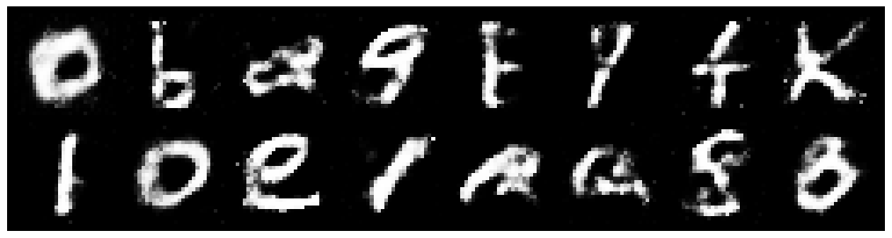
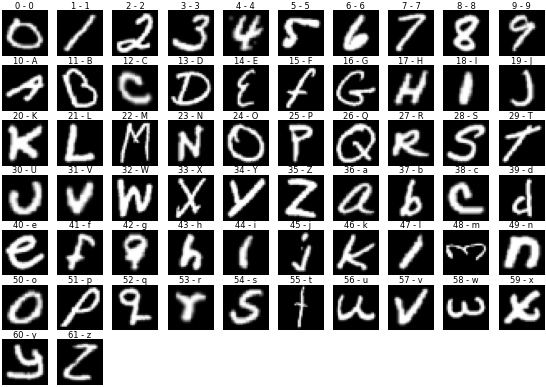
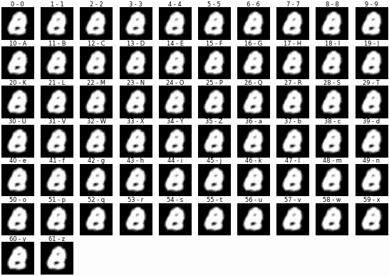

## Fonting with GANs

During my virtual residency at the [Recurse Center](https://www.recurse.com/), one of my goals was to get comfortable with pyTorch and Jupyter notebooks. Another was to build some highly responsive UI around machine learning. I haven't seen a lot of projects running inference on the frontend, so I decided to try client-side image generators with [ONNX Runtime](https://onnxruntime.ai/docs/get-started/with-javascript.html).

My first was a Generative Adversarial Net with the EMNIST handwriting dataset. And putting the prize up front, it worked!

<iframe src="https://codesandbox.io/embed/7rd69j?view=Editor+%2B+Preview&module=%2Fsrc%2Findex.js&hidenavigation=1"
     style="width:100%; height: 500px; border:0; border-radius: 4px; overflow:hidden;"
     title="EMNIST ONNX demo"
     allow="accelerometer; ambient-light-sensor; camera; encrypted-media; geolocation; gyroscope; hid; microphone; midi; payment; usb; vr; xr-spatial-tracking"
     sandbox="allow-forms allow-modals allow-popups allow-presentation allow-same-origin allow-scripts"
   ></iframe>

Big picture, this involved:

- training on a fast desktop with a Jupyter notebook
- collecting inputs for desired outputs (62 alphanumeric characters)
- exporting the trained network as .onnx
- some math for interpolating between inputs

Unlike diffusion networks, GANs produce images in a single fast feedforward step, and their output makes up a smooth and [structured](https://machinelearningmastery.com/how-to-interpolate-and-perform-vector-arithmetic-with-faces-using-a-generative-adversarial-network/) latent space. So I thought they might be fast enough for animation, and their animation might be formally compelling.

I used Diego Gomez's [Vanilla GAN in PyTorch](https://github.com/diegoalejogm/gans) as a starting point, swapped the MNIST dataset for EMNIST, and plotted out the first batch of training data:


It turns out TorchVision's EMNIST data is mirrored and rotated -90 degrees. A couple extra transforms set things right:

```python
compose = transforms.Compose([
  transforms.ToTensor(),
  transforms.Normalize([0.5], [0.5]),

  # rotate all images -90deg counter-clockwise
  transforms.RandomRotation((-90,-90)),
  # horizontal flip all images (probability = 1)
  transforms.RandomHorizontalFlip(p=1),
])
```

Everything worked as expected after that, and 200 training epochs later, the network was making letter-like images. Because I wasn't using labeled data, these random samples show a mix of recognizable characters and hybrid weirdos.



## The Map

To render an actual letter repeatably, I'd need to find a nice version generated by the network and note the 100-value input that created it (or its coordinates in this particular 100-dimensional image-space). This is what one address looks like:

`[
    -1.0, -1.0, 1.0, -0.0486, -1.0, 0.9989, -1.0, -0.1445, -0.3458, 1.0, 1.0,
    -1.0, 1.0, 1.0, -1.0, -0.3575, 1.0, -1.0, 0.7807, -1.0, -1.0, -1.0, 1.0,
    1.0, 1.0, 0.1007, -1.0, 1.0, -0.9726, -1.0, 1.0, -1.0, -0.9486, 1.0, 0.2914,
    1.0, -1.0, 1.0, -1.0, -1.0, -1.0, 0.1367, -0.9471, 0.2176, 1.0, -1.0,
    0.6586, 0.8326, -0.7876, -1.0, -0.3623, 0.5928, 0.7861, 1.0, 0.546, -1.0,
    -1.0, 0.4815, 1.0, -1.0, 1.0, 1.0, 0.3592, 1.0, -0.0093, -1.0, -1.0, -1.0,
    0.8022, 0.8678, -1.0, -1.0, -1.0, -1.0, 1.0, -1.0, 0.9368, 0.983, 0.9562,
    0.6253, -0.5211, -1.0, -1.0, -1.0, 1.0, 1.0, -0.2063, -0.1222, 0.9239,
    0.4377, -1.0, 1.0, -1.0, -1.0, -1.0, -0.3888, 0.7914, -0.6846, -0.9638, 1.0,
  ]`

I gathered these manually for a while by randomly sampling and copy-pasting the input for any well-formed character. This got less and less effective as I filled out my collection, and it became clear that I needed to automate.

## Inversion

I give thanks to Fast.ai's [great explanation of SGD](https://github.com/fastai/fastbook/blob/master/04_mnist_basics.ipynb) for making this thinkable: For each character, I'd take a single real example from the labeled data and _gradient-descend_ through the latent space for a similar fake image. This is possible because we can treat the input/coordinates of an image just like we treat model weights during training: feedforward through the network, determine the error between the output and the real image, and backpropagate to learn how each value should change. My search function ended up looking something like this:

```python
def inversion_search(target_img, generator, steps=100, rate=0.01):
	input = torch.zeros(100).requires_grad_()

    for i in range(steps):
        loss = emnist_gan_mse(input, target_img, generator)
        loss.backward()

        with torch.no_grad():
            for j in range(len(input)):
                input[j] = torch.clamp(input[j] - input.grad[j] * rate, -1, 1)

    return input
```

And here's the search for each character's perfect match, reals above, fakes below:





## Packaging for the Frontend

With a map to every character I'd want to render, it was time to bring the generator network into the browser. torch.onnx needs to actually run the model to export it, so I provided an input, then names for the data going in and out, which became object keys when I used in in JavaScript.

```python
torch.onnx.export(
	# network with desired weights loaded
	generator,
	# properly shaped random input
	torch.randn(1, 100),
	# output filename
	"vgan_emnist.onnx",
	# JS object keys
    input_names=["z"],
    output_names=["img"],

    verbose=False,
    export_params=True,
)
```

The sandbox at the beginning of this writeup uses `onnxruntime-web` to run the exported file, and we're now ready to get weird with it in the browser.
